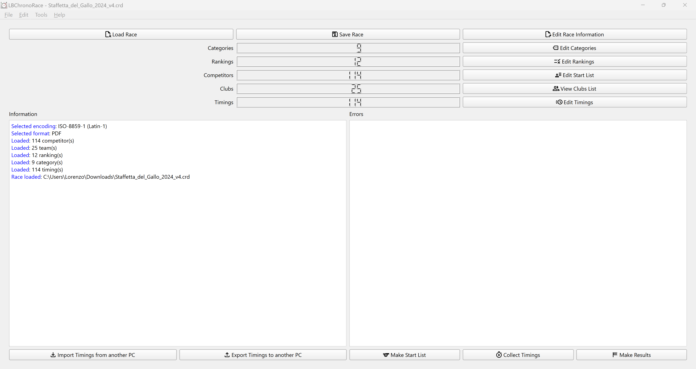
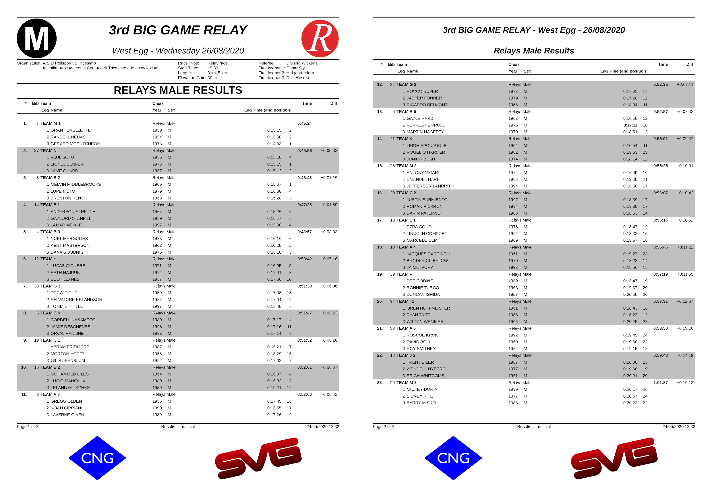

# LBChronoRace

<!-- [](https://travis-ci.com/flinco/LBChronoRace) -->
[](https://github.com/flinco/LBChronoRace/releases)

[](https://github.com/flinco/LBChronoRace/blob/master/README.md)

Software Desktop gratuito per produrre le classifiche delle corse podistiche in diversi formati (PDF, CSV, testo).

<kbd></kbd>
<kbd></kbd>

## Funzionalità

- Dati gara, inclusi loghi istituzionali e fino a 4 loghi di sponsor
- Supporto per gare con partenza in linea, a cronometro e a staffetta
- Tabella dati atleta
- Tabella categorie
- Tabella classifiche
- Tabella tempi con registrazione in tempo reale
- Calcolo automatico della frazione (per le gare a staffetta)
- Tutte le tabelle consentono sia l'inserimento manuale dei dati che l'importazione/esportazione in CSV
- Codifica Latin1 o UTF-8 selezionabile per importazione/esportazione in CSV
- Classifiche e Ordini di partenza in PDF, CSV o testo

## Scaricare

Scarica il codice sorgente più recente da [releases page](http://github.com/flinco/LBChronoRace/releases).

## Sviluppo

LBChronoRace è basato su [Qt](http://www.qt.io/).

### Clona and Esegui

Per eseguire LBChronoRace scarica i sorgenti

```bash
# clona LBChronoRace
git clone https://github.com/flinco/LBChronoRace.git

# portati sul branch master
cd LBChronoRace
git checkout master
```

importa il file di progetto `CMakeLists.txt` in [Qt Creator](http://www.qt.io/product/development-tools) (è richiesto Qt 6.0 o più recente), compila ed esegui l'applicazione.

### Sviluppa LBChronoRace

Per sviluppare LBChronoRace scarica i sorgenti

```bash
# clona LBChronoRace
git clone https://github.com/flinco/LBChronoRace.git

# portati sul branch di sviluppo
cd LBChronoRace
git checkout develop
```

importa il file di progetto `CMakeLists.txt` in [Qt Creator](http://www.qt.io/product/development-tools) (è richiesto Qt 6.0 o più recente).

## Licenza

[GNU General Public License v3.0](LICENSE)

## Donazioni

Questo progetto è realizzato con passione e dedizione. Se trovi l'applicazione utile e desideri supportarne lo sviluppo, considera di fare una donazione.

[](https://www.paypal.com/donate/?hosted_button_id=B3TPDBK3ZF5YJ)
