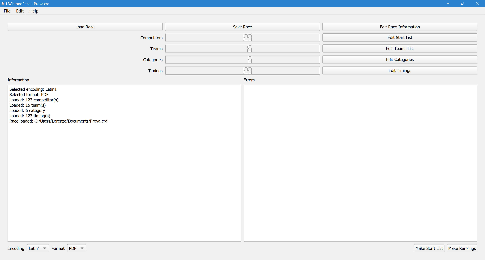
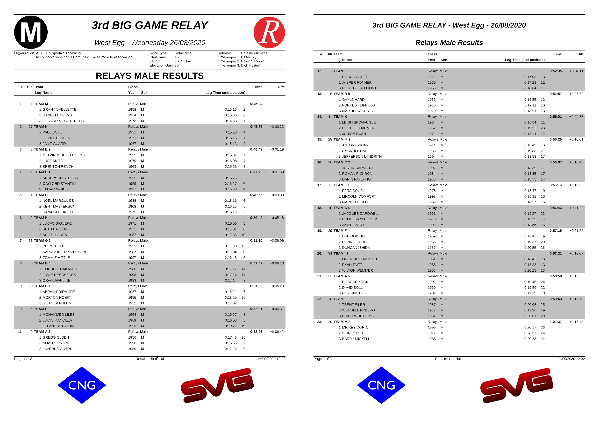

# LBChronoRace

<!-- [](https://travis-ci.com/flinco/LBChronoRace) -->
[](https://github.com/flinco/LBChronoRace/releases)


Free Desktop software for producing the results of footraces in different formats (PDF, CSV, plain text).

<kbd></kbd>
<kbd></kbd>

## Features

1. Race data, including institutional logos and up to 4 sponsor brands
1. Competitors infromation table allowing manual data input and import/export from/to CSV
   - Latin1 or UTF-8 encoding for import/export from/to CSV
1. Categories table allowing manual data input and import/export from/to CSV
   - Latin1 or UTF-8 encoding for import/export from/to CSV
1. Timings table allowing manual data input and import/export from/to CSV
   - Automatic leg detection and leg hint (for relay races)
   - Latin1 or UTF-8 encoding for import/export from/to CSV
1. Start list in PDF, CSV or plain text
   - Latin1 or UTF-8 encoding for CSV and plain text 
1. Results in PDF, CSV or plain text
   - Latin1 or UTF-8 encoding for CSV and plain text 
1. Relay races support

## Download

Download the latest released source code from the [releases page](http://github.com/flinco/LBChronoRace/releases).

## Development

LBChronoRace is based on [Qt](http://www.qt.io/).

### Clone and Run

To run LBChronoRace download the source

```bash
# clone LBChronoRace
git clone https://github.com/flinco/LBChronoRace.git

# move to the master branch
cd LBChronoRace
git checkout master
```

import the project file `CMakeLists.txt` in [Qt Creator](http://www.qt.io/product/development-tools) (Qt 6.0 or newer is required), build it and run the application.

### Developing with LBChronoRace

To develop alongside LBChronoRace download the source

```bash
# clone LBChronoRace
git clone https://github.com/flinco/LBChronoRace.git

# move to the development branch
cd LBChronoRace
git checkout develop
```

and import the project file `CMakeLists.txt` in [Qt Creator](http://www.qt.io/product/development-tools) (Qt 6.0 or newer is required).

## License

[GNU General Public License v3.0](LICENSE)
