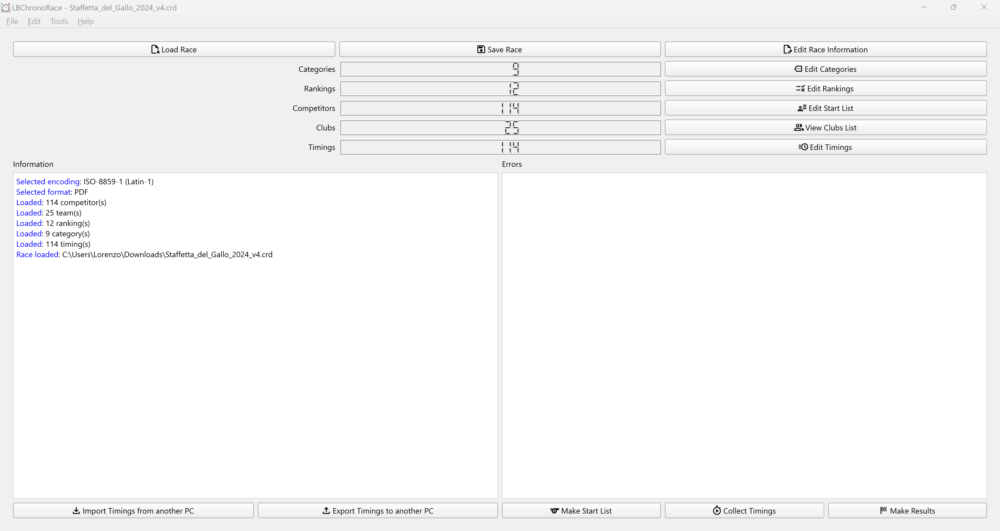

# LBChronoRace

<!-- [](https://travis-ci.com/flinco/LBChronoRace) -->
[](https://github.com/flinco/LBChronoRace/releases)

[](https://github.com/flinco/LBChronoRace/blob/master/README.md)
[](https://github.com/flinco/LBChronoRace/blob/master/README.it.md)

Free Desktop software for producing the results of footraces in different formats (PDF, CSV, plain text).

<kbd></kbd>
<kbd></kbd>

## Features

- Race data, including institutional logos and up to 4 sponsor brands
- Mass start, Timed and Relay races support
- Competitors information table
- Categories table
- Rankings table
- Timings table with real-time recording
- Automatic leg detection and leg hint (for relay races)
- All the tables allow both manual data entry and import/export to CSV
- Latin1 or UTF-8 encoding for import/export from/to CSV
- Results and Start list in PDF, CSV or plain text

## Download

Download the latest released source code from the [releases page](http://github.com/flinco/LBChronoRace/releases).

## Development

LBChronoRace is based on [Qt](http://www.qt.io/).

### Clone and Run

To run LBChronoRace download the source

```bash
# clone LBChronoRace
git clone https://github.com/flinco/LBChronoRace.git

# move to the master branch
cd LBChronoRace
git checkout master
```

import the project file `CMakeLists.txt` in [Qt Creator](http://www.qt.io/product/development-tools) (Qt 6.0 or newer is required), build it and run the application.

### Developing with LBChronoRace

To develop alongside LBChronoRace download the source

```bash
# clone LBChronoRace
git clone https://github.com/flinco/LBChronoRace.git

# move to the development branch
cd LBChronoRace
git checkout develop
```

and import the project file `CMakeLists.txt` in [Qt Creator](http://www.qt.io/product/development-tools) (Qt 6.0 or newer is required).

## License

[GNU General Public License v3.0](LICENSE)

## Donations

This project is made with passion and dedication. If you find the application helpful and would like to support its development, consider making a donation.

[](https://www.paypal.com/donate/?hosted_button_id=8NZWAMWPKCA7C)
